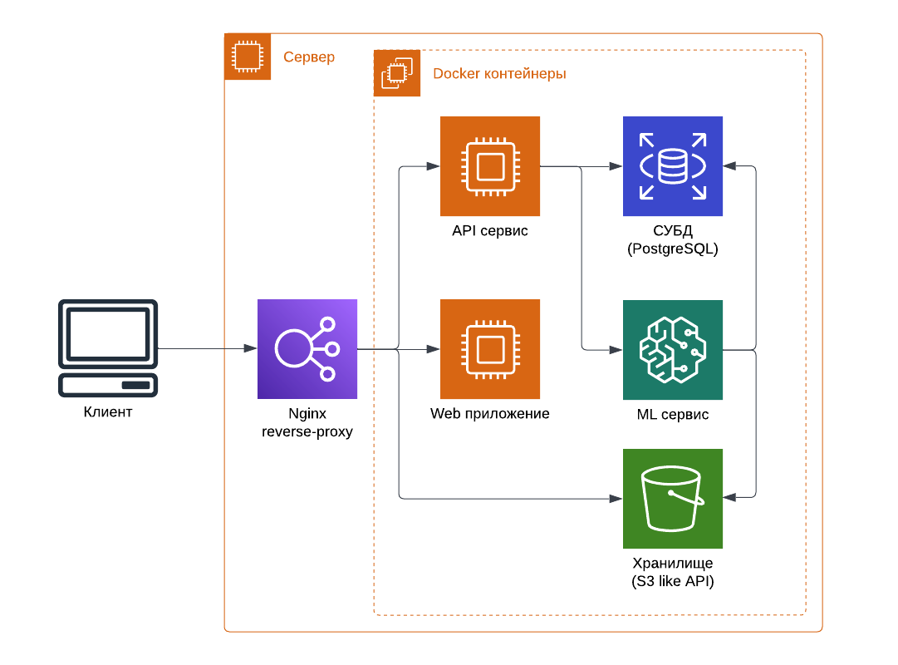
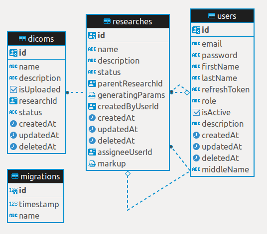

# Описание проекта

## Архитектурная диаграмма



## Основные компоненты системы

### Фронтенд
Ссылка - [https://leaders2022-web.issart.com/](https://leaders2022-web.issart.com/)

Язык: [TypeScript](https://www.typescriptlang.org/)

Используемые библиотеки:
- [Пакетный менеджер Yarn](https://yarnpkg.com/)
- [ReactJS](https://reactjs.org/)
- [Фреймворк Refine](https://refine.dev/)
- [Cornerstone3D](https://www.cornerstonejs.org/)
- [HTTP клиент axios](https://axios-http.com/ru/docs/intro)
- [Работа с архивами zip.js](https://gildas-lormeau.github.io/zip.js/)

Реализовано 3 основных представления:

1. Users - управление пользователями
2. Researches - работа с исследованиями
3. Dicoms - загрузка и просмотр DICOM файлов.

### Бекенд

Swagger UI - [https://leaders2022-api.issart.com/api/v1/docs/](https://leaders2022-api.issart.com/api/v1/docs/)

Язык: [TypeScript](https://www.typescriptlang.org/)

Используемые библиотеки:
- [Пакетный менеджер Yarn](https://yarnpkg.com/)
- [NodeJS](https://nodejs.org/en/)
- [Фреймворк NestJS](https://nestjs.com/)
- [Фреймворк TypeORM](https://typeorm.io/)
- [nestjs-s3](https://github.com/svtslv/nestjs-s3#readme)
- [passport-local, passport-jwt](https://www.passportjs.org/)

Бекенд приложение включает в себя модули:
- auth (авторизация/аутентификация)
- user (работа с пользователями)
- research (работа с исследованиями)
- dicom (работа с DICOM файлами)
- cloud (инструментарий для работы с облачным хранилищем)

Миграции БД:
- Создание по существующим моделям данных
- Применение и откат
- Поддержка работы с миграциями на разных окружениях

### СУБД
СУБД [PostgreSQL](https://www.postgresql.org/)

#### Схема БД:


### Объектное хранилище
S3-совместимое облачное хранилище [Minio](https://min.io/)


### ML

Язык: [Python 3.8](https://www.python.org/)

Используемые библиотеки:
- [pytorch](https://pytorch.org/)
- [scikit-image](https://scikit-image.org/)
- [porespy](https://porespy.org/)
- [OpenCV](OpenCV)
- [pydicom](https://pydicom.github.io/)
- [torchgan](https://github.com/torchgan/torchgan)
- [lungmask](https://github.com/JoHof/lungmask)

#### Протестированные гипотезы:
Главной гипотезой реализации генерации является гипотеза наложение ковидных, раковых и метастатических заболеваний, как шум на части легких. Основанием для гипотезы является следующее замечание: ткани с заболеваниями выделяются в КТ представлении на фоне нормальных легочных тканей. Таким образом, необходимо наложить сгенерированное заболевание таким образом, чтобы болезнь выделялась на фоне легочной ткани. Основная проблемы гипотезы - как генерировать заболевания максимально правдоподобно и как накладывать сгенерированные заболевания на доли легких без явных (видимых) искажений оригинального КТ.

#### Используемые модели решения и причины такого выбора:
Для генерации ковидных заболеваний использовалась GAN нейронная сеть DCGAN в реализации библиотеки [torchgan](https://github.com/torchgan/torchgan). Данная модель простая и относительно не долго обучается, поэтому выбор пал на неё для генерации.
Для сегментации легочных долей легкого использовалась библиотека [lungmask](https://github.com/JoHof/lungmask). Удобство получения модели и ее использование стало критерием, по которому она была выбрана. Стоит отметить, что существуют и более современные модели с более высоким  уровнем точности, но чтобы запустить и протестировать время хакатона недостаточно.
Для генерации раковых и метастатических заболеваний использовалась библиотека [porespy](https://porespy.org/), которая предоставляет достаточный функционал для генерации 2d шумов, которые накладываются на доли КТ лёгких.

#### Используемые методы обработки данных:
Предобработки данные не выполнялось, поскольку библиотека lungmask хорошо работает с разными КТ.

#### Ограничения и условия, введенные внутри решения:
Генерация ковидного, ракового или метастатического заболевания не должно располагаться на не легочной ткани


## Запуск и развертывание

### Требования

- OS Linux
- docker (v20.15+)
- docker-compose (v2+)

### Файлы конфигурации

- [Бекенд](backend/ops-tools/environments)
- [ML](generator/ops-tools/environments)

Включают в себя 2 преднастроенных окружения:
- local - для разработки
- test - текущее развернутое решение


### Запуск проекта на окружении test

```
$ git clone https://github.com/sstopkin/leaders2022-hackathon.git
$ cd leaders2022-hackathon
$ docker-compose -f docker-compose-test.yml build
$ docker-compose -f docker-compose-test.yml up -d minio-migrations
$ docker-compose -f docker-compose-test.yml up -d
```

### Подготовка и миграции БД

Инициализация схемы БД:
```
$ ENV=<envname> yarn migration:run
```

[SQL скрипт для инициализации основных пользователей](backend/ops-tools/sql/create-admin.sql)

[SQL скрипт для инициализации 10 демо-пользователей](backend/ops-tools/sql/create-demo-users.sql)

### Настройка nginx в режиме reverse-proxy

Пример конфигурационного файла для настройки nginx. Необходимо настроить для 3 сущностей - фронтенд, бекенд и хранилище.
```
upstream backend {
  server 127.0.0.1:8080;
}

server {
  listen 80;
  server_name api.example.com;
  client_max_body_size 500M;

  location / {
    if ($request_method = 'OPTIONS') {
      add_header 'Access-Control-Allow-Origin' *;
      add_header 'Access-Control-Allow-Methods' 'GET, HEAD, PATCH, POST, PUT, DELETE, OPTIONS';
      add_header "Access-Control-Allow-Credentials" "true";
      #
      # Custom headers and headers various browsers *should* be OK with but aren't
      #
      add_header 'Access-Control-Allow-Headers' 'DNT,User-Agent,X-Requested-With,If-Modified-Since,Cache-Control,Content-Type,Range,Authorization';
      #
      # Tell client that this pre-flight info is valid for 20 days
      #
      add_header 'Access-Control-Max-Age' 1728000;
      add_header 'Content-Type' 'text/plain; charset=utf-8';
      add_header 'Content-Length' 0;
      return 204;
    }
    add_header 'Access-Control-Allow-Headers' 'DNT,User-Agent,X-Requested-With,If-Modified-Since,Cache-Control,Content-Type,Range,Authorization';
    add_header 'Access-Control-Allow-Methods' 'GET, HEAD, PATCH, POST, PUT, DELETE, OPTIONS';
    add_header 'Access-Control-Allow-Origin' *;
    add_header "Access-Control-Allow-Credentials" "true" always;
    add_header 'Access-Control-Expose-Headers' 'Content-Length,Content-Range';

    proxy_pass http://backend;
    proxy_http_version 1.1;
    proxy_set_header Upgrade $http_upgrade;
    proxy_set_header Connection 'upgrade';
    proxy_set_header Host $host;
    proxy_cache_bypass $http_upgrade;
    proxy_set_header X-forward-for $proxy_add_x_forwarded_for;
    proxy_set_header X-real-ip $remote_addr;
  }
}
```
